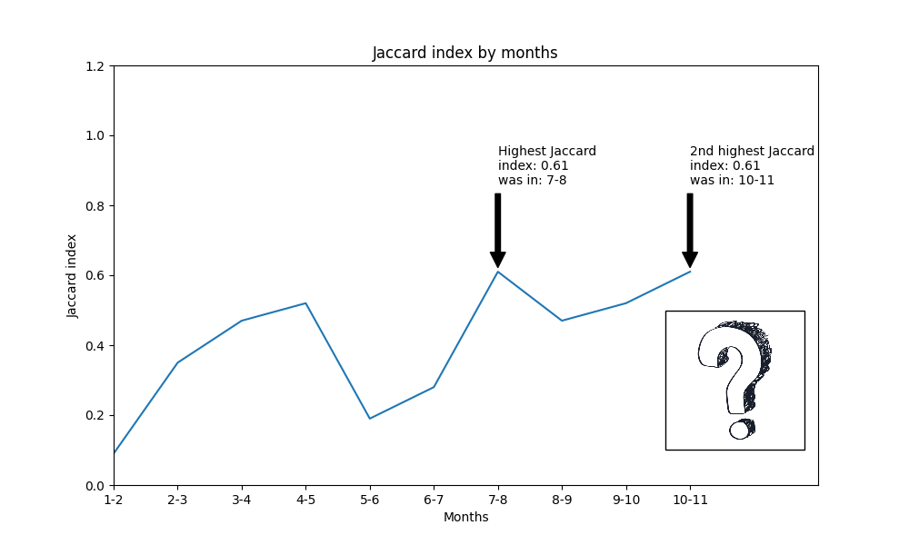

# Web Scrapping And Data Analysis

### **Autor**: 
Lorena Mršić

### **Mentori**:
_izv. prof. dr. sc._ Ana Meštrović

_dr. sc._ Slobodan Beliga

### **Kolegij**:
Upravljanje znanjem

### **Vrijeme izrade**
Studeni 2020 - Prosinac 2020

---

### Opis projekta

Projekt se odnosi na prikupljanje i analizu podataka sa web portala Rijeka Danas(https://www.rijekadanas.com/) te je podijeljen na dva djela:
1. Prvi dio projekta - prikupljanje tekstualnih podataka s web-a. Prikupljeni su svi linkovi članaka sa odabranog portala te su iz svakog članka izdvojeni željeni podaci te spremljeni u .csv i .json datoteku. 
2. Drugi dio projekta - analiza prethodno prikupljenih podataka, raspodijeljena na tri djela:
  - Kvantificiranje članaka u medijima - Naglasak analize je na aktualnom virusu Covid-19. Prethodno prikupljene članke smo svrstali u one koji su korona tematike i one koji nisu, te je cilj vidjeti koji je omjer 'korona članaka' naspram ostalih članaka.  Članci su pobrojeni i kategorizirani po danima, mjesecima i kategorijama.
  - Vizualizacija rezultata - rezultati iz prethodnog koraka su prikazani koristeći razne vrste grafikona
  - Analiza jezičnog diskursa korištenog na portalu - Analizirani su najčešće korišteni pojmovi i termini u objavama vezanim uz korona tematiku. Također je izračunat Jaccard-ov indeks za pojedine mjesece.

---

## Rezultati

### Vizualizacija rezultata

U grafu su prikazana dva Pie grafikona: 
- Prvi prikazuje koliko članaka ima u pojedinim kategorijama od ukupnog broja članaka
- Drugi pokazuje omjer korona članaka po kategorijama od ukupnog broja korona članaka

!

U sljedećem grafu je prikazan proljetni period, odnosno period u kojem je bilo najviše članaka vezanih uz korona virus, te je izdvojen dan u kojem je bilo najviše članaka, a to je 9.4.2020 sa čak 121 članaka. 

!

### Analiza jezičnog diskursa korištenog na portalu

Prikazati ćemo najčešćih 25 riječi u 1. mjesecu i 4. mjesecu, dok se ostali rezultati nalaze pod Projektom 2. unutar graph datoteke:

**1 mjesec**:           |  **2 mjesec**:
:-------------------------:|:-------------------------:
  |  

Jaccardov indeks nam prikazuje gotovo istu situaciju kao i krivulja korona podataka prema danima, odnosno imamo pad u 6-7 mjesecu i onda opet povećanje. Dva najviše slična skupa su 7 i 8 mjesec i 10 i 11 mjesec s indeksom od 0.61. Bilo bi interesantno vidjeti koliki bi bio indeks između 11 i 12 mjeseca, no to je bilo izvan našeg proučavanog razdoblja za ovaj projekt.

